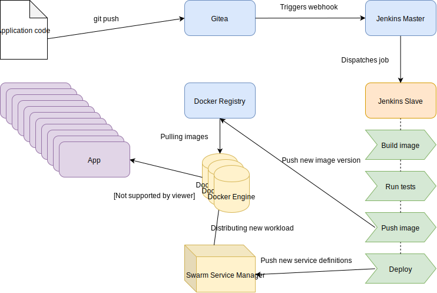

# CI/CD Cluster

## Definitions
**Continuous Integration**
> In software engineering, continuous integration (CI) is the practice of merging all developer working copies to a shared mainline several times a day. (Wikipedia)

> Continuous integration is the practice of routinely integrating code changes into the main branch of a repository, and testing the changes, as early and often as possible. Ideally, developers will integrate their code daily, if not multiple times a day. (Atlassian)

**Continuous Deployment**
> Continuous deployment happens when every change to the main branch that passes the CI tests gets pushed to production without the need for human interaction. This often results in many deployments per day which provide fast feedback to the development team. (Atlassian)

## Cluster overview


## Prerequisites
In order to participate into this workshop you need to have **docker-machine** installed.
After installing docker-machine create at least three nodes:

```bash
for i in 1 2 3; do docker-machine create -d virtualbox --virtualbox-memory "4096" swarm-$i; done;
```

## Initialize a cluster
Before we can start setting up a full CI-CD pipeline we need to create a brand new cluster.
First, let's connect all the nodes to form a cluster.

Initialize Swarm mode on the first node:
``` bash
docker swarm init --advertise-addr=$(docker-machine ip swarm-1)
```

Get the join-token for the other nodes:
``` bash
export MANAGER_TOKEN=$(docker swarm join-token manager -q)
```

And connect the other two nodes:
``` bash
for i in 2 3; do \
    eval $(docker-machine env swarm-$i); \
    docker swarm join $(docker-machine ip swarm-1):2377 --token $MANAGER_TOKEN; \
done;
```

Our cluster is now initialized.

## Visualization of our cluster
After we've initialized our cluster, we can visualize it with a dedicated service. Start the service with:
``` bash
docker service create \
  --name=visualizer \
  --publish=8000:8080/tcp \
  --constraint=node.role==manager \
  --mount=type=bind,src=/var/run/docker.sock,dst=/var/run/docker.sock \
  dockersamples/visualizer
```

The visualizer is now exposed on the host at port `8000` on all three nodes. 

## Setup Docker Registry
For the cluster we are going to extend the Jenkins image with some Docker capabilities. Therefore we need a private registry where we can store our custom images. Create the registry as a service in our cluster:
``` bash
docker service create \
  --publish 5000:5000 \
  --name registry \
  registry:2
```

## Build Jenkins
Jenkins needs a custom build with Docker installed to be able to mount the docker socket and pass it to Docker build slaves. Therefore, build the custom image. The image has Docker included and permissions are configured correctly so it can run with the regular Jenkins user.

``` bash
DOCKER_BUILDKIT=1 docker build -t localhost:5000/tijmen/jenkins:lts ./jenkins
```

Finally, push the image to the registry:

``` bash
docker push localhost:5000/tijmen/jenkins:lts
```

To check if the image was successfully pushed to the registry, we can make an API-call to the registry to list all repositories:
``` bash
curl http://$(docker-machine ip swarm-1):5000/v2/_catalog
```

## Setup Gitea/Jenkins
Deploy the basic services

``` bash
docker stack deploy -c docker-compose.yml ci
```


## Start Jenkins
``` bash
open "http://$(docker-machine ip swarm-1):8080"
```

Get root password:
``` bash
docker exec $(docker container ps -f name=ci_jenkins -q) cat /var/jenkins_home/secrets/initialAdminPassword
```

Or to copy it directly to the clipboard from a Mac:
``` bash
make copy_jenkins_pwd
```

Install the suggested plugins.

## Config Gitea
``` bash
open "http://$(docker-machine ip swarm-1):3000"
```
At the moment, the `SSL_DOMAIN` environment variable is not set automatically.

Set it to the *IP address of the Docker daemon*, which will be **192.168.99.100** or **localhost**.

## Connect Gitea with Jenkins

* (optional) Remove existing SSH entry (192.168.99.100:2222) from `~/.ssh/known_hosts`
* Create account in Gitea
* Add your SSH public key in Gitea (`make copy_public_key` for Mac)
* Download **Gitea** and **Docker** plugin for Jenkins
* Configure Gitea plugin:
  * [Add server here](http://192.168.99.100:8080/configure)
  * Use credentials from Gitea account
  * The host to connect to is [http://192.168.99.100:3000](http://192.168.99.100:3000)
  * Use username as organization name
* Click **new item** -> **Gitea organization** and enter your username as the item's name.

## Config Docker in Jenkins (docker-machine)
Download the Docker plugin and browse to [/configure](http://192.168.99.100:8080/configure).
Add a new cloud (Docker) with the following details:

key | value |
-----|-----|
Name | docker |
Docker Host URI | unix:///var/run/docker.sock |
Docker Hostname or IP address | unix:///var/run/docker.sock |

After that, click `test connection` to confirm everything is working.

Next, configure a Docker Agent Template with the following details:

key | value |
-----|--------|
Labels | docker |
Enabled | true |
Name | docker |
Docker Image | odavid/jenkins-jnlp-slave |

Also add the container settings for the template:

key | value |
-----|-----|
Volumes | /var/run/docker.sock:/var/run/docker.sock |

Last but not least set the connect method to **Connect with JNLP** and click **save**.
